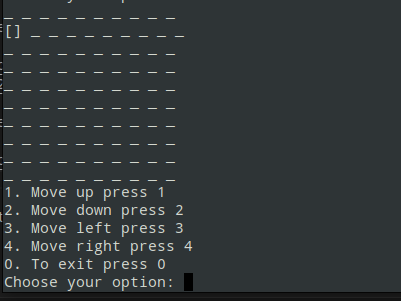

# CLI based NODE JS APP

<h2>To Run This App</h2>

<h3>Requirements</h3>
<ul>
    <li>any os</li>
    <li>nodejs</li>
    <li>teminal</li>
</ul>

<br/>

``` node index.js ``` 

<h3>main interface look like</h3><br/>


<h3>for right move enter 4</h3><br/>


<h3>for left move enter 3</h3><br/>


<h3>for down move enter 2</h3><br/>




<h3>for up move enter 1</h3><br/>


<hr/>

## thank you for visit this app.